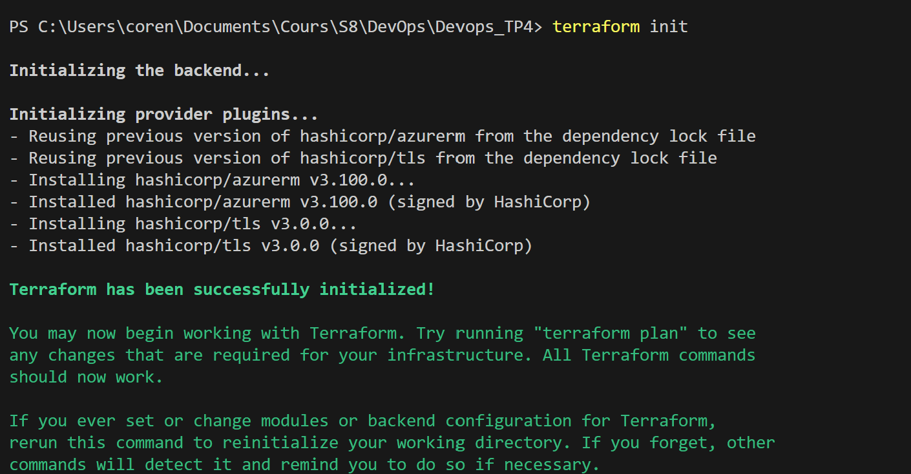
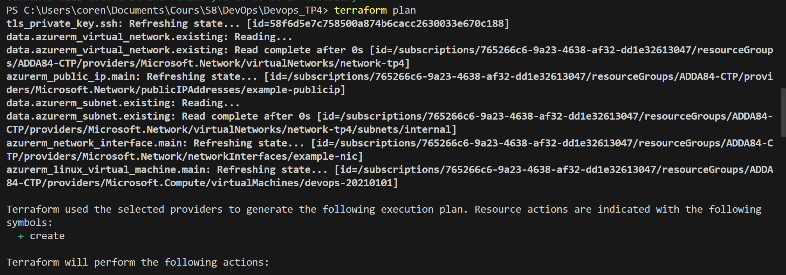
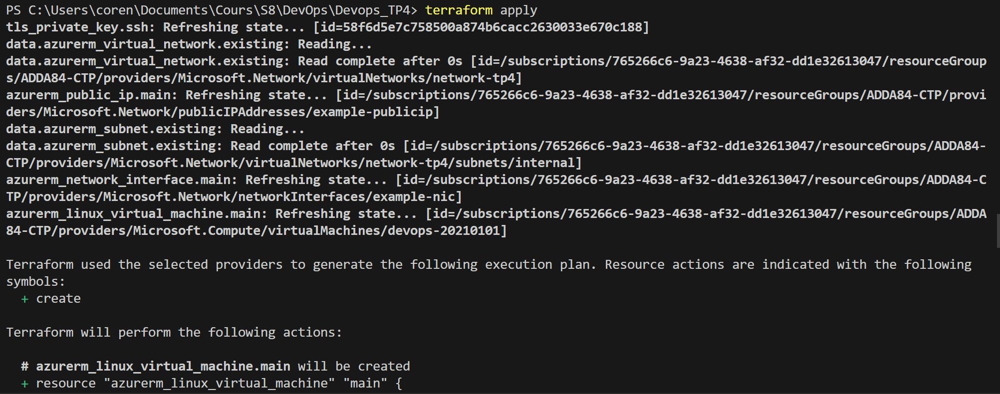
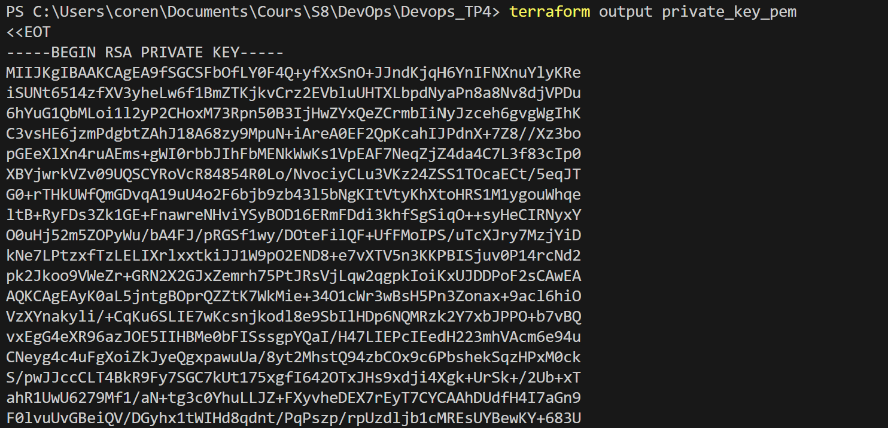
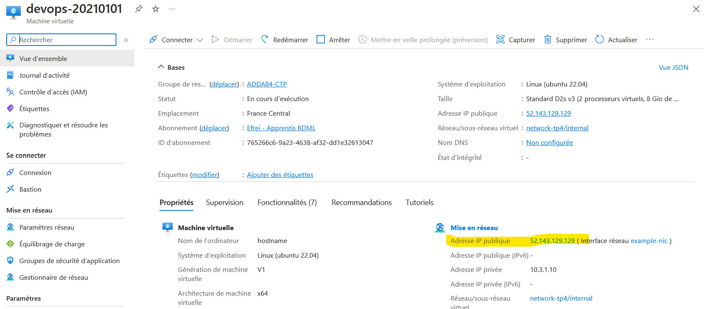
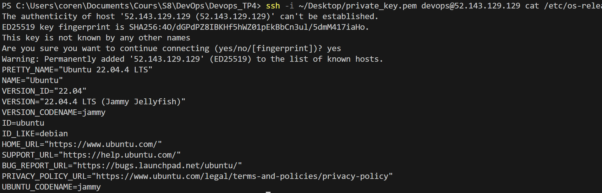

# TP1

(hash correspondant à la dernier version du TP1 : d9fa6b031b40db7192aef090e58083f921e8fa0f)

## Etape suivi :

Création du code

## Test du code et de l'API : 

Initialiser les valeurs :

```
set LAT=5.902785
set LONG=102.754175
set API_KEY=29ebece2943379cab1c8a846b5fc2c97
```
Executer le code :
```
python meteo.py
```
Résultat :
```
Coordonnées : longitude 102.7542, latitude 5.9028
Météo : overcast clouds
Température : 301.8 Kelvin
Vitesse du vent : 6.33 m/s
Pression atmosphérique : 1012 hPa
Humidité : 78%
Pays : MY
```

## Pour créer l'image docker :
```
docker build -t my_weather_api .
```

On peut tester le code en faisant la comande suivante :
```
docker run --env LAT=5.902785 --env LONG=102.754175 --env API_KEY="29ebece2943379cab1c8a846b5fc2c97" my_weather_api
```

Pour push l'image sur dockerhub :
```
docker tag my_weather_api corentin339/20210101
```
Ensuite, je suis allé sur docker desktop, appuyé sur les trois petits points à côté de l'image créée et appuyé sur "Push to Hub".

## Pour l'installer, vous devez faire :
```
docker pull corentin332/20210101
docker run --env LAT=5.902785 --env LONG=102.754175 --env API_KEY="your_key" my_weather_api
```
Ne pas oublier de changer "your_key" par votre clé

# TP2

<<<<<<< HEAD
<<<<<<< HEAD
(hash correspondant à la dernier version du TP2 : 240286d9e4f06d23f4bf34f135d914291cff6a34)
=======
(hash correspondant à la dernier version du TP1 : 240286d9e4f06d23f4bf34f135d914291cff6a34)
>>>>>>> eadb20e0c9036d4ce8f6325cf6ec94a33f55cda1

## Etape suivi :

Modification des fichiers meteo.py et Dockerfile.

Création du fichier "docker_build_push.yaml" qui va automatiquement mettre à jour l'image docker dès que nous faisons un push sur github.

Création de deux repository secrets correspondant secrets.DOCKERHUB_USERNAME et secrets.DOCKERHUB_PASSWORD dans mon docker_build_push.yaml.

## Test de l'API

Dans un CMD, executez ce code en changeant l'API_KEY par votre numéro d'API_KEY
```
docker run -p 8081:8081 --env API_KEY=29ebece2943379cab1c8a846b5fc2c97 corentin339/20210101:latest
```

Dans un autre CMD, executez ce code :
```
curl "http://localhost:8081/?lat=5.902785&lon=102.754175"
```

On obtient le résultat suivant :
```
{"coordinates":{"latitude":5.9028,"longitude":102.7542},"country":"MY","description":"overcast clouds","humidity":73,"pressure":1008,"temperature":302.41,"wind_speed":5.47}
```

# TP3

<<<<<<< HEAD
(hash correspondant à la dernier version du TP3 : eadb20e0c9036d4ce8f6325cf6ec94a33f55cda1)

=======
>>>>>>> eadb20e0c9036d4ce8f6325cf6ec94a33f55cda1
## Etape bonus :

Modification du fichier meteo.py pour réaliser le bonus :
Utilisation des bibliothèques Prometheus pour exposer un endpoint HTTP/metrics. Création d'un compteur pour représenter le nombre de requêtes traitées.

### test :

Ouvrez un CMD et executez le code suivant :
```
set API_KEY=29ebece2943379cab1c8a846b5fc2c97
python meteo.py
```
Ouvrez un second CMD et executez le code suivant :
```
curl "http://localhost:8081/?lat=5.902785&lon=102.754175"
```
Vous obtiendrez ce résultat ici :
```
{"coordinates":{"latitude":5.9028,"longitude":102.7542},"country":"MY","description":"overcast clouds","humidity":73,"pressure":1011,"temperature":302.48,"wind_speed":5}
```
Et pour afficher les métrics, executez ce code :
```
curl "http://localhost:8081/metrics"
```
Qui devrais donner un résultat similaire :
```
# HELP python_gc_objects_collected_total Objects collected during gc
# TYPE python_gc_objects_collected_total counter
python_gc_objects_collected_total{generation="0"} 551.0
python_gc_objects_collected_total{generation="1"} 47.0
python_gc_objects_collected_total{generation="2"} 0.0
# HELP python_gc_objects_uncollectable_total Uncollectable objects found during GC
# TYPE python_gc_objects_uncollectable_total counter
python_gc_objects_uncollectable_total{generation="0"} 0.0
python_gc_objects_uncollectable_total{generation="1"} 0.0
python_gc_objects_uncollectable_total{generation="2"} 0.0
# HELP python_gc_collections_total Number of times this generation was collected
# TYPE python_gc_collections_total counter
python_gc_collections_total{generation="0"} 87.0
python_gc_collections_total{generation="1"} 7.0
python_gc_collections_total{generation="2"} 0.0
# HELP python_info Python platform information
# TYPE python_info gauge
python_info{implementation="CPython",major="3",minor="11",patchlevel="5",version="3.11.5"} 1.0
# HELP request_count_total Total number of requests received
# TYPE request_count_total counter
request_count_total 2.0
# HELP request_count_created Total number of requests received
# TYPE request_count_created gauge
request_count_created 1.7129269070397422e+09
```

## Etape suivi :

Modification du fichier yml. Ajout du code permettant de push l'image à chaque nouveau commit sur ACR.

Le code permettant de push l'image sur docker à chaque nouveau commit a également été laissé en cas de modification du code.

Afin d'être en accord avec le port de notre fichier python, j'ai modifié le port désigné dans azure pour avoir le port 8081.
On est donc obligé d'ajouter le numéro de port directement sur la commende. J'ai choisis de modifier le port de azure pour être en accord avec les deux tps précédent.

## Test de l'API

Ouvrez un CMD et executez le code suivant :
```
curl "http://devops-20210101.francecentral.azurecontainer.io:8081/?lat=5.902785&lon=102.754175"
```

Vous devez obtenir le résultat suivant :
```
{"coordinates":{"latitude":5.9028,"longitude":102.7542},"country":"MY","description":"overcast clouds","humidity":73,"pressure":1011,"temperature":302.54,"wind_speed":5.2}
```

# TP4

Pour ce TP4, j'ai créé un nouveau dossier appelé Devops_TP4, contenant les fichiers main.tf pour définir les ressources principales et ssh_key.tf pour générer une paire de clés SSH.

J'ai, dans un premier lieu, du tgélécharger terraform sur ma machine ainsi que Azure CLI et les mettre dans mes variables d'environnements.

Une fois celà fait, j'ai exécuter ce code :
```
terraform init
```


Une fois que ceci était bon, j'ai exécuter cette deuxième commande :
```
terraform plan
```


J'ai ensuite executer la commande apply :
```
terraform apply
```


Ensuite, j'ai créer un fichier que j'ai nommé private_key.pem et que j'ai placé dans mon bureau.
J'y ai mis la clé que la requête suivante m'a donné :
```
terraform output private_key_pem
```


Puis, en prenant l'adresse IP public de ma machine virtuel qui a été créée sur Azure :


J'execute la commende suivante pour se connecter à la VM :
```
ssh -i ~/Desktop/private_key.pem devops@52.143.129.129 cat /etc/os-release
```


Enfin on execute la commande suivante lorsque nous avons terminé :
```
terraform destroy
```